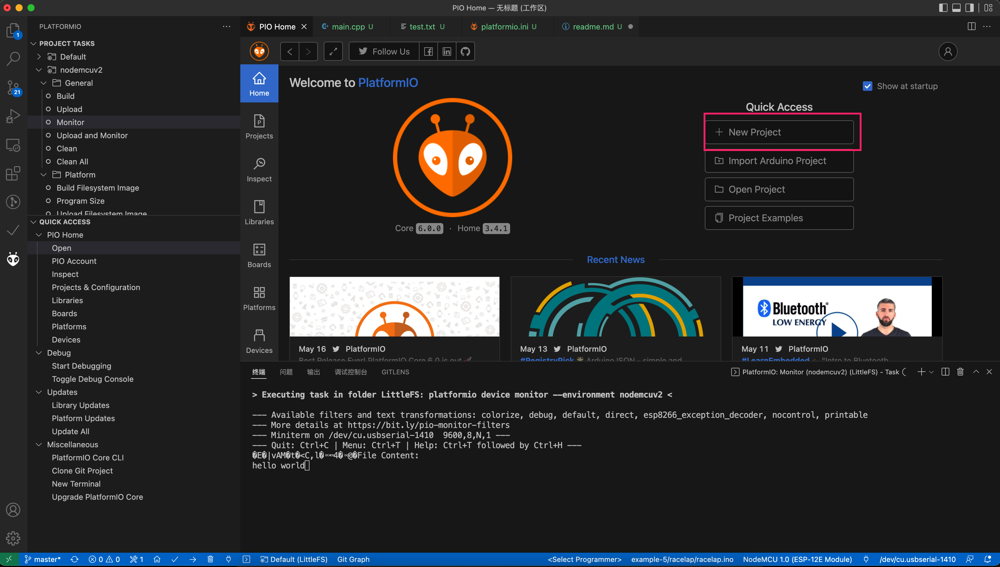
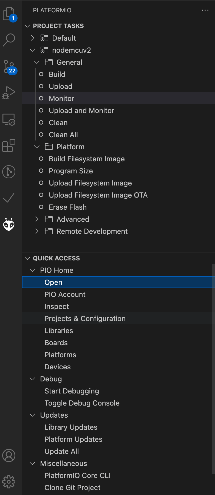
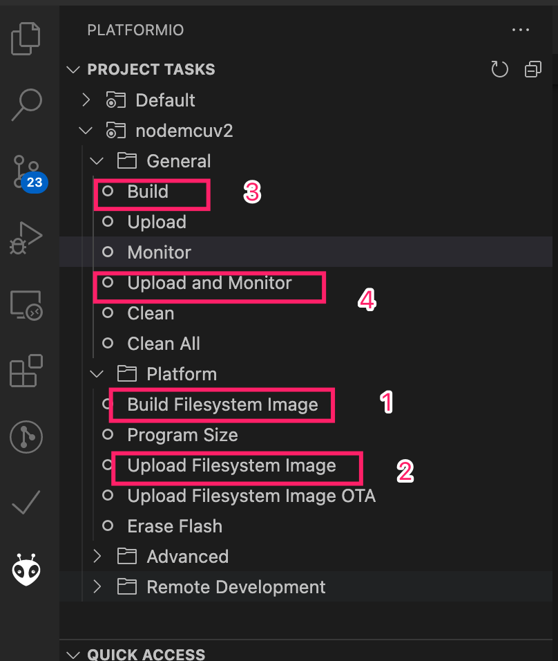
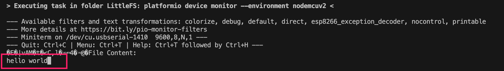

## 使用PlatformIO了解arduino littleFS

### 使用  VS Code + PlatformIO 开发
1. 安装vscode 插件 PlatformIO 
2. 使用PlatformIO 新建一个项目LitteFS

3. 修改platformio.ini 为
```
[env:nodemcuv2]
platform = espressif8266
board = nodemcuv2
framework = arduino
board_build.filesystem = littlefs
```
4. 熟悉下PlatformIO 面板


5. LittleFS 项目新增data文件夹 ,必须使用data名字
   文件下面新增一个test.txt ,内容hello world

6. src/main.cpp 使用下列代码 测试下littlefs
```
/*********
  Rui Santos
  Complete project details at https://RandomNerdTutorials.com/esp8266-nodemcu-vs-code-platformio-littlefs/
*********/

#include <Arduino.h>
#include "LittleFS.h"

void setup()
{
  Serial.begin(9600);

  if (!LittleFS.begin())
  {
    Serial.println("An Error has occurred while mounting LittleFS");
    return;
  }

  File file = LittleFS.open("/test.txt", "r");
  if (!file)
  {
    Serial.println("Failed to open file for reading");
    return;
  }

  Serial.println("File Content:");
  while (file.available())
  {
    Serial.write(file.read());
  }
  file.close();
}

void loop()
{
}

```

7. 使用PlatformIO 面板的下列功能


8. 然后就可以在控制台看到

