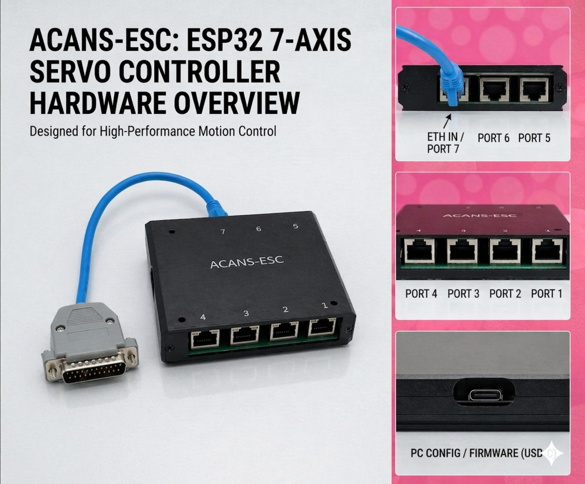
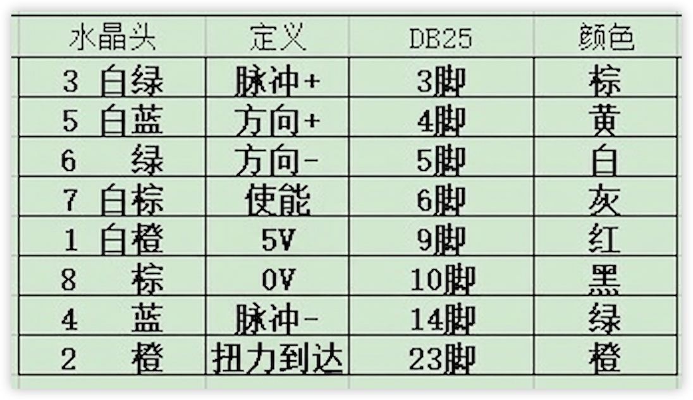
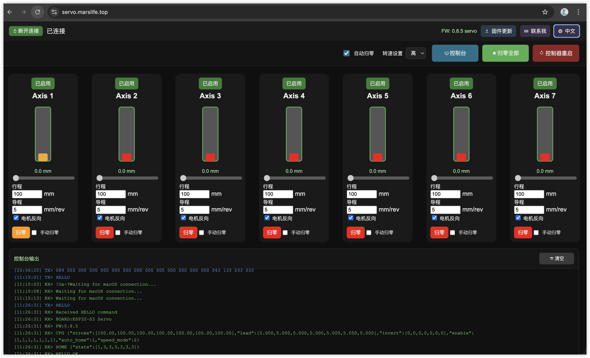

# ACANS 7轴伺服运动控制器产品功能书

## 1. 产品概述
ACANS 7轴伺服运动控制器是一款专为高阶模拟器设计的专业级控制器。它能够精准驱动多达 7 路伺服电机，为赛车模拟器（Sim Racing）和飞行模拟器（Flight Sim）提供极致的动态反馈与姿态模拟。

### 核心优势
- **多轴联动**：原生支持 7 轴输出，适配 2DOF 至 6DOF 及附加轴（如安全带张紧、横摆等）系统。
- **软件生态**：完美兼容 FlyPT Mover、SimTools、SimHub 等主流运动控制软件。
- **工业级接口**：采用 RJ45 接口输出，通过标准转接线可适配各类主流伺服驱动器。

---

## 2. 硬件连接说明

### 接线定义 (RJ45 to DB25)
控制器使用标准的 RJ45 接口进行信号输出，便于布线与维护。以下为推荐的 RJ45 转 DB25（常用伺服接口）接线定义：

*注：请根据您使用的伺服驱动器手册确认具体引脚定义，确保脉冲（PULSE）与方向（DIRECTION）信号正确连接。*

---

## 3. 软件控制界面

控制器内置了直观的 Web 端管理界面，用户无需安装额外软件即可进行参数配置与状态监控。

### 主要功能列表
- **轴参数配置**：独立设置每个轴的行程 (Stroke)、导程 (Lead) 及电机方向。
- **实时运动控制**：支持滑块调试、手动归零及一键自动归零。
- **运行模式切换**：支持高、中、低三档转速模式，适应不同场景需求。
- **系统监控台**：实时显示 TX/RX 原始通信数据，方便协议分析与排障。

---

## 4. 快速上手指南

1. **连接电源与网络**：确保控制器正常供电并连接至您的局域网。
2. **访问后台**：在浏览器中访问控制台地址（默认为 `servo.marslife.top` 或设备 IP）。
3. **参数匹配**：根据您模拟器平台的物理结构，在界面中填入各轴的行程与导程。
4. **归零校准**：点击“归零全部”确保机械零点正确。
5. **联动软件**：在 FlyPT Mover 或 SimTools 中配置对应的输出协议，开始模拟体验。

---

## 5. 技术规格
| 参数项目 | 规格描述 |
| :--- | :--- |
| 控制轴数 | 7 轴 (Axis 1 - Axis 7) |
| 信号类型 | 脉冲 + 方向 (Pulse / Direction) |
| 输出接口 | 7 x RJ45 |
| 通信协议 | 兼容 FlyPT / SimTools / SimHub 标准协议 |
| 配置方式 | Web 网页跨平台配置 |
| 扩展功能 | 支持固件在线更新 (OTA) |

---
*© 2026 ACANS Motion Control. All rights reserved.*
