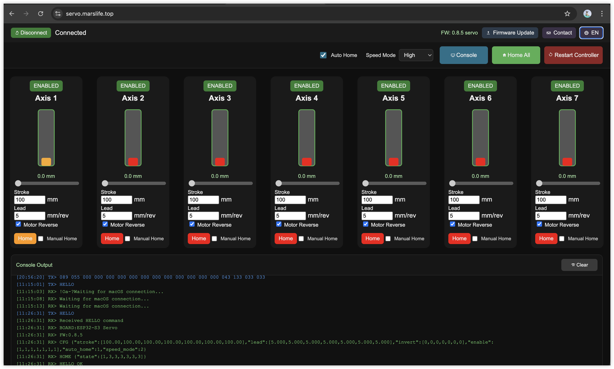

# ACANS 7-Axis Servo Motion Controller Product Specification

## 1. Overview
The ACANS 7-Axis Servo Motion Controller is a professional-grade solution designed specifically for high-end motion simulators. It precisely drives up to 7 servo motors, providing ultimate dynamic feedback and attitude simulation for Sim Racing and Flight Simulation.

### Key Advantages
- **Multi-Axis Linkage**: Native support for 7-axis output, compatible with 2DOF to 6DOF systems plus additional axes (e.g., seatbelt tensioners, surge, etc.).
- **Software Ecosystem**: Seamlessly compatible with industry-standard motion software including FlyPT Mover, SimTools, and SimHub.
- **Industrial Interface**: Utilizes RJ45 outputs for clean wiring, easily adaptable to various mainstream servo drives via standard adapter cables.

---

## 2. Hardware Connectivity

### Wiring Definition (RJ45 to DB25)
The controller uses standard RJ45 ports for signal output, ensuring easy maintenance and reliable connections. Recommended RJ45 to DB25 (common servo interface) wiring definition:

| Crystal Pin | Wire Color   | Function       | DB25 Pin | Color  |
| ----------- | ------------ | -------------- | -------- | ------ |
| 3           | White-Green  | Pulse +        | 3        | Brown  |
| 5           | White-Blue   | Direction +    | 4        | Yellow |
| 6           | Green        | Direction -    | 5        | White  |
| 7           | White-Brown  | Enable         | 6        | Gray   |
| 1           | White-Orange | +5V            | 9        | Red    |
| 8           | Brown        | 0V (GND)       | 10       | Black  |
| 4           | Blue         | Pulse -        | 14       | Green  |
| 2           | Orange       | Torque Reached | 23       | Orange |

---

## 3. Software Control Dashboard

The controller features an intuitive built-in web-based management interface, allowing for parameter configuration and status monitoring without any additional software installation.

### Core Features
- **Axis Configuration**: Independent settings for Stroke, Lead, and Motor Direction for each axis.
- **Real-time Motion Control**: Supports slider-based debugging, manual homing, and one-click "Home All" functionality.
- **Performance Modes**: Selectable High, Medium, and Low speed modes to suit different simulation requirements.
- **System Diagnostics**: Real-time TX/RX raw data console for protocol analysis and troubleshooting.

---

## 4. Quick Start Guide

1. **Power & Network**: Ensure the controller is powered and connected to your local network.
2. **Access Dashboard**: Open a browser and navigate to the dashboard (default: `servo.marslife.top` or the device IP).
3. **Mechanical Calibration**: Enter the Stroke and Lead parameters corresponding to your physical platform.
4. **Initial Homing**: Click "Home All" to calibrate mechanical zero points.
5. **Software Linkage**: Configure the output protocol in FlyPT Mover or SimTools to begin your simulation experience.

---

## 5. Technical Specifications
| Parameter | Description |
| :--- | :--- |
| Number of Axes | 7 Axes (Axis 1 - Axis 7) |
| Signal Type | Pulse + Direction |
| Output Interface | 7 x RJ45 |
| Communication | Compatible with FlyPT / SimTools / SimHub standards |
| Configuration | Cross-platform Web UI |
| Extras | Supports OTA Firmware Updates |

---
*© 2026 ACANS Motion Control. All rights reserved.*
